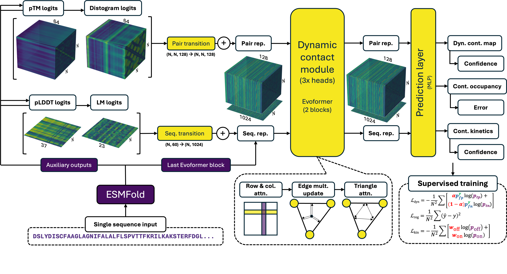
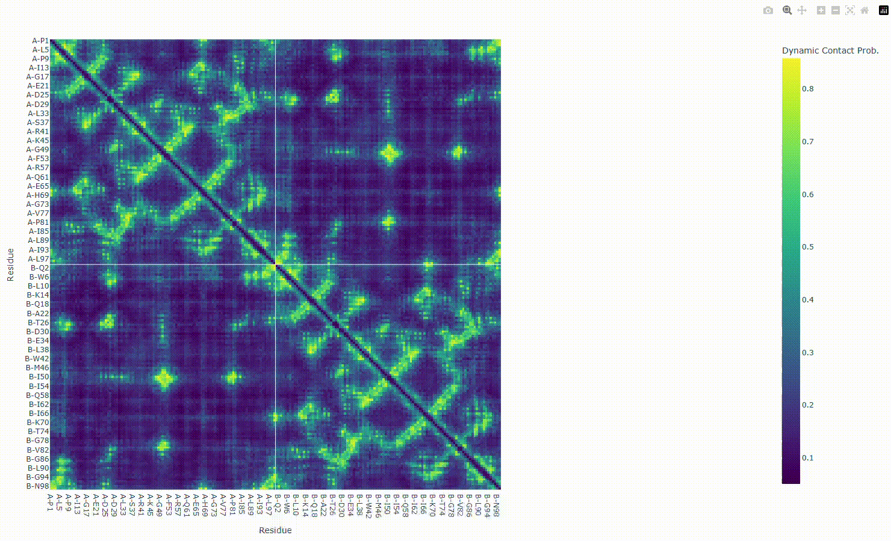

# ESMDynamic
[](https://www.biorxiv.org/content/10.1101/2025.08.20.671365v1)
[](https://colab.research.google.com/github/ShuklaGroup/esmdynamic/blob/main/examples/esmdynamic/esmdynamic.ipynb)
[](https://doi.org/10.13012/B2IDB-3773897_V2)


This is the code repository for [ESMDynamic: Fast and Accurate Prediction of Protein Dynamic Contact Maps from Single Sequences](https://www.biorxiv.org/content/10.1101/2025.08.20.671365v1).
This repository is based on [Evolutionary Scale Modeling](https://github.com/facebookresearch/esm), which has been archived.



<details close><summary><b>Table of contents</b></summary>

- [Usage](#usage)
    - [Quick Start](#quickstart)
    - [Installation](#install)
    	- [Docker](#install-docker)
    	- [Conda](#install-conda)
  - [Bulk Prediction](#bulkprediction)
  - [Output Interpretation](#output)
  - [Visualization](#visualization)
- [Available Models and Datasets](#available)
  - [Pretrained Model](#available-model)
  - [Datasets](#available-datatsets)
  - [Human Proteome](#proteome)
- [Training](#training)
- [Citations](#citations)
- [License](#license)
</details> 

## Usage <a name="usage"></a>

### Quick Start <a name="quickstart"></a>

If you wish to use the model to predict a small number of sequences, we recommend you simply use our [Google Colab Notebook](https://colab.research.google.com/github/ShuklaGroup/esmdynamic/blob/main/examples/esmdynamic/esmdynamic.ipynb) with manual sequence entry.

Otherwise, building a Docker image with the `Dockerfile` is the simplest option to get started. Within the container, [`run_esmdynamic`](esm/esmdynamic/predict.py) can be used to predict sequences in batches from a [FASTA](examples/esmdynamic/example.fasta) or [CSV](examples/esmdynamic/example.csv) file using flags `--fasta` or `--csv`. 

### Installation <a name="install"></a>

We recommend using the Dockerfile method to create an image with all required packages. Due to package deprecations, it may be difficult to install all requirements in a Python (e.g., Conda) environment. Additionally, the Docker setup process conveniently downloads the model weights. The only downside is that the Docker image takes relatively more space (~20 GB).

#### Docker <a name="install-docker"></a>

First, make sure you have installed [Docker](https://docs.docker.com/engine/install/). 

Since a GPU is recommended to run the model, you should have installed the [NVIDIA Container Toolkit](https://docs.nvidia.com/datacenter/cloud-native/container-toolkit/latest/install-guide.html) as well.

Next, follow the commands:

```bash
git clone https://github.com/ShuklaGroup/esmdynamic.git # Clone repo
cd esmdynamic
docker build -t esmdynamic .
docker run --rm -it --gpus all -v "$PWD":/workspace esmdynamic # Run container in current dir w/GPU access
run_esmdynamic -h # Print help for prediction script 
```

#### Conda <a name="install-conda"></a>

Install [Conda](https://www.anaconda.com/docs/getting-started/miniconda/install) if not available. Create an environment and install packages (this is using Python 3.11, CUDA 12.6, torch 2.7.1).

```bash
conda create -n esmdynamic python=3.11.13
conda activate esmdynamic
conda install nvidia/label/cuda-12.6.3::cuda-nvcc # If you don't have nvcc
conda install -c nvidia cuda-toolkit 
pip3 install torch torchvision torchaudio # Should give 2.7.1+cu126
pip install scipy omegaconf pytorch_lightning biopython ml_collections einops py3Dmol modelcif matplotlib plotly[express] dm-tree tensorboard
pip install git+https://github.com/NVIDIA/dllogger.git
pip install git+https://github.com/sokrypton/openfold.git # Use the ColabFold fork!
pip install git+https://github.com/ShuklaGroup/esmdynamic.git
```

You can then run the [`run_esmdynamic`](esm/esmdynamic/predict.py) script for inference:

```bash
run_esmdynamic -h # Print docs, will download weights when needed
```

### Bulk Prediction <a name="bulkprediction"></a>

The [`predict.py`](esm/esmdynamic/predict.py) script is the implementation for the executable `run_esmdynamic`. These are the docs:

```
usage: run_esmdynamic [-h] (--sequence SEQUENCE | --fasta FASTA | --csv CSV) [--batch_size BATCH_SIZE] [--chunk_size CHUNK_SIZE] [--device {cpu,cuda}] [--output_dir OUTPUT_DIR]
                      [--chain_ids CHAIN_IDS] [--low_memory] [--save_html] [--save_png] [--save_txt] [--save_raw_pt] [--num_recycles NUM_RECYCLES]

Predict dynamic contacts, frequency, and kinetics using ESMDynamic.

options:
  -h, --help            show this help message and exit
  --sequence SEQUENCE   Single sequence string.
  --fasta FASTA         Path to FASTA file with sequences.
  --csv CSV             CSV file with sequences (first column ID, second column sequence).
  --batch_size BATCH_SIZE
                        Batch size.
  --chunk_size CHUNK_SIZE
                        Model chunk size.
  --device {cpu,cuda}   Device to use.
  --output_dir OUTPUT_DIR
                        Directory where outputs will be written.
  --chain_ids CHAIN_IDS
                        Chain IDs to use for labels (e.g. ABCDEF). Default: A-Z.
  --low_memory          Use low-memory inference mode.
  --save_html           Also save interactive HTML heatmaps.
  --save_png            Save PNG heatmaps/plots.
  --save_txt            Save text/CSV outputs.
  --save_raw_pt         Save a .pt bundle with all cropped outputs for each sequence.
  --num_recycles NUM_RECYCLES
                        Optional number of recycles to pass to the model.
```

With FASTA file input, the headers will be used as protein IDs. With CSV input, the first row are column headers, the first column contains protein IDs, and the second column contains the protein sequences.

Use `:` to separate chains (unless using the Colab Notebook, then use `/`).

To recreate the dynamic contact maps in our publication, use either of the files in [examples](examples/esmdynamic):

```bash
run_esmdynamic --csv example.csv --output_dir example
```

The output directory will contain the numerical output for each sequence in a plain text file that can be easily read by `numpy.loadtxt`. A PNG image and a HTML-based visualization file are also provided.

Depending on your system's memory, you may change the default values for `batch_size` or `chunk_size` to trade off between speed and VRAM.

### Output Interpretation <a name="output"></a>

For a detailed breakdown of model outputs, please read our accompanying documentation: [ESMDynamic Output Interpretation](output_interpretation.md)

### Visualization <a name="visualization"></a>

If you use the [`run_esmdynamic`](esm/esmdynamic/predict.py) script or the [Colab Notebook](https://colab.research.google.com/github/ShuklaGroup/esmdynamic/blob/main/examples/esmdynamic/esmdynamic.ipynb), you will obtain an interactive HTML file that makes visualization easier. Open the file with a browser. Functionality includes zooming in and creating screen captures.




# Avilable Models and Datasets <a name="available"></a>

## Pretrained Model <a name="available-model"></a>

The ESMDynamic model weights are available at the Illinois Data Bank under [DOI:10.13012/B2IDB-3773897_V2](https://doi.org/10.13012/B2IDB-3773897_V2). Note you must still obtain the ESMFold weights to run the model. A simple way to download the weights is with:

```python
import esm
model = esm.pretrained.esmdynamic()
```

Weights will be found in the path given by `torch.hub.get_dir()`.

## Datasets <a name="available-datatsets"></a>

Three datasets are available at [DOI:10.13012/B2IDB-3773897_V2](https://doi.org/10.13012/B2IDB-3773897_V2). Follow the instructions in the README at the [Data Bank](https://doi.org/10.13012/B2IDB-3773897_V2) (reproduced below) to convert the files to the format needed for training. Each directory contains information about the data splits (list of identifiers in CSV format) and the weigths used for sampling during training (`.pt` format).

| Dataset Name      | Original Data Source                                                           | Related Publication |
|-------------------|--------------------------------------------------------------------------------|---------------------|
| [ATLAS (Test Set)](https://databank.illinois.edu/datafiles/kennn/download)  | [ATLAS Database](https://www.dsimb.inserm.fr/ATLAS)                            | [ATLAS](https://doi.org/10.1093/nar/gkad1084) |
| [mdCATH](https://databank.illinois.edu/datafiles/qacyy/download)            | [mdCATH Dataset](https://huggingface.co/datasets/compsciencelab/mdCATH)        | [mdCATH](https://www.nature.com/articles/s41597-024-04140-z) |
| [RCSB Clusters](https://databank.illinois.edu/datafiles/485qm/download)     | [RCSB](https://www.rcsb.org/)                                                   | [RCSB](https://www.frontiersin.org/journals/bioinformatics/articles/10.3389/fbinf.2023.1311287/full)                 |

After downloading a `.zip` file, prepare the data:

```bash
unzip mdcath.zip # Change name as needed
cd mdcath
tar -xvf mdcath.tar.gz
python esm/esmdynamic/training/convert_csv_to_torch.py mdcath/
```

> [!WARNING]  
> RCSB dataset expands into a large directory (>20 GB).

## Human Proteome <a name="proteome"></a>

You can access predictions for most of the proteins in the human proteome (UniProt Proteome ID UP000005640) on the [data repository](https://doi.org/10.13012/B2IDB-3773897_V2). See this [table](https://databank.illinois.edu/datafiles/yy1re/download) to find what archive fragment contains the predictions you need.

# Training <a name="training"></a>

First download and convert the required dataset from [DOI:10.13012/B2IDB-3773897_V2](https://doi.org/10.13012/B2IDB-3773897_V2) following the README from the Data Bank (or see instructions above). Then, you can use the [`train.py`](esm/esmdynamic/training/train.py) script from this repository. You will need to write a file with training parameters, named something like `train_params.txt`, for example:

```
--train_identifiers_file=./mdcath/train.csv
--val_identifiers_file=./mdcath/val.csv
--train_weights_file=./mdcath/train_weights.pt
--val_weights_file=./mdcath/val_weights.pt
--data_dir=./mdcath/mdcath/
--outpath=./train_output/
--batch_size=4
--batch_accum=16 # 4*16 = 64 effective batch size
--epochs=1000
--train_samples_per_epoch=1000
--val_samples_per_epoch=100
--weight_positive=0.85
--decay_rate=2
--pretrained=checkpoint.pt # Path to a full state dict
```

Then, training can be run with:

```bash
python esm/esmdynamic/training/train.py @train_params.txt
```

# Citations <a name="citations"></a>

If you use this code or its related datasets, please cite:

```bibtex
@article {Kleiman2025.08.20.671365,
	author = {Kleiman, Diego E and Feng, Jiangyan and Xue, Zhengyuan and Shukla, Diwakar},
	title = {ESMDynamic: A Fast and Accurate Prediction of Protein Dynamic Contact Maps from Single Sequences},
	elocation-id = {2025.08.20.671365},
	year = {2025},
	doi = {10.1101/2025.08.20.671365},
	publisher = {Cold Spring Harbor Laboratory},
	URL = {https://www.biorxiv.org/content/early/2025/08/24/2025.08.20.671365},
	eprint = {https://www.biorxiv.org/content/early/2025/08/24/2025.08.20.671365.full.pdf},
	journal = {bioRxiv}
}
```

You should also include citations to the related publications if appropriate:
- [ESMFold](https://www.science.org/doi/10.1126/science.ade2574)
- [RCSB](https://www.frontiersin.org/journals/bioinformatics/articles/10.3389/fbinf.2023.1311287/full)
- [mdCATH](https://www.nature.com/articles/s41597-024-04140-z)
- [ATLAS](https://doi.org/10.1093/nar/gkad1084)

# License <a name="license"></a>

Code is shared under the MIT [License](LICENSE).

Code from ESM is also shared under the MIT License (see [`THIRD_PARTY_NOTICES.txt`](THIRD_PARTY_NOTICES.txt)).
